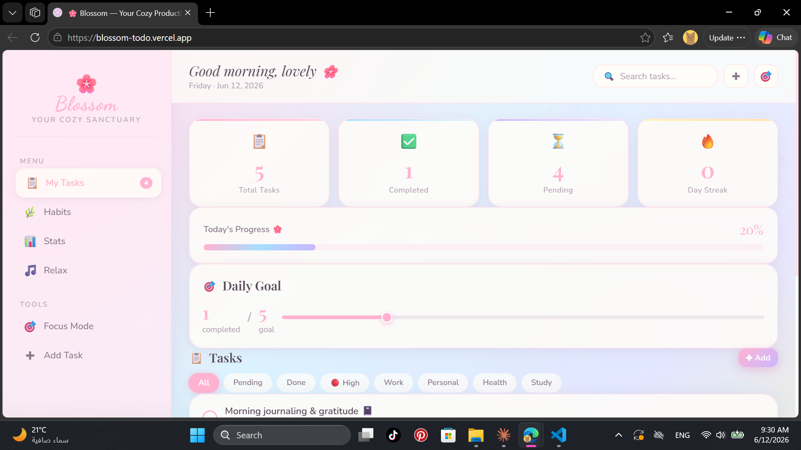
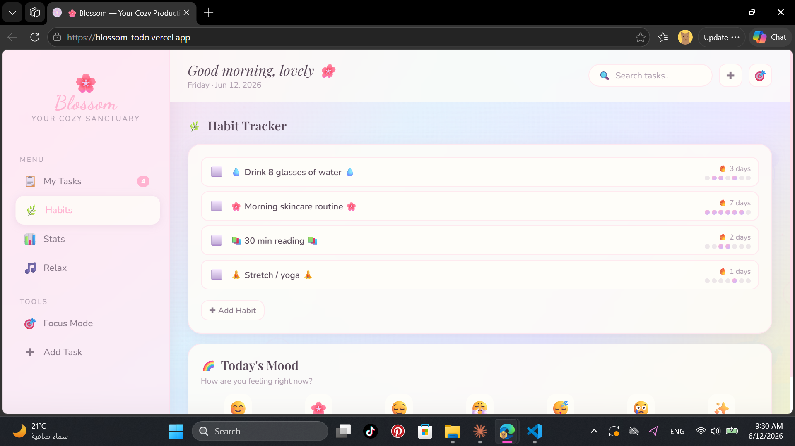
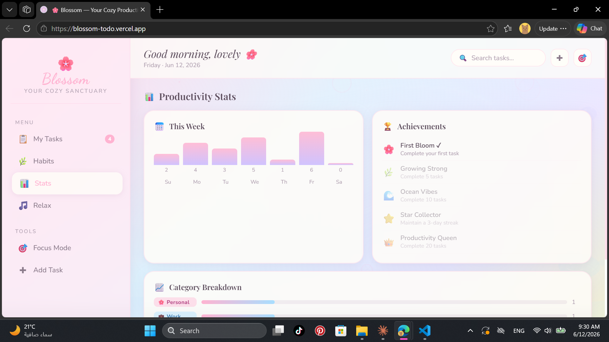
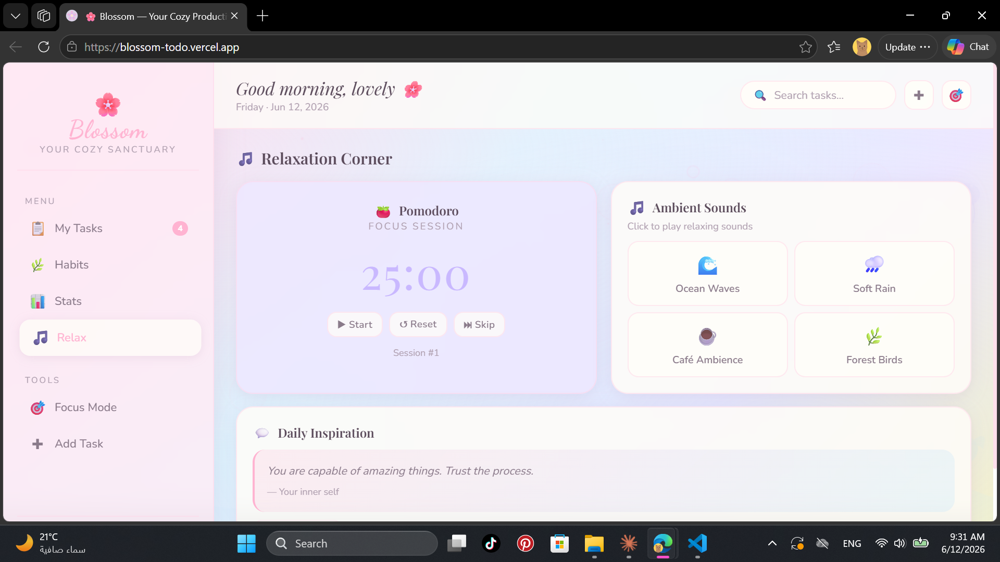
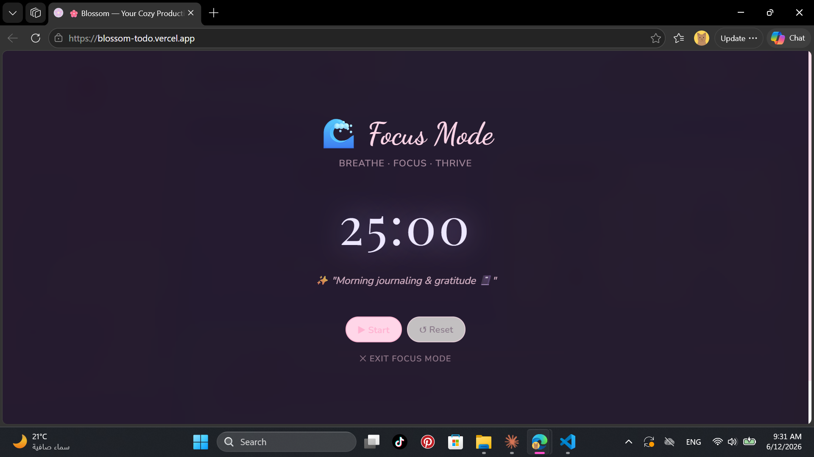

# 🌸 Blossom — Cozy Productivity App

Blossom is a calm and modern productivity web application designed to help you stay organized while maintaining balance and mindfulness.  
It combines task tracking, habit building, productivity insights, and a relaxing focus environment into one seamless experience.

🔗 Live Demo: https://blossom-todo.vercel.app

---

## ✨ Features

- **Task Management** — Organize your tasks and track daily progress easily.
- **Habit & Mood Tracking** — Build routines and monitor your daily mood.
- **Productivity Analytics** — Visual insights into your weekly performance.
- **Relaxation Mode** — Pomodoro timer with ambient sounds for focus.
- **Focus Mode** — Minimal full-screen mode for deep concentration.

---

## 📸 App Preview

### Dashboard & Task Management
Overview of tasks, progress, and daily goals.

---

### Habit Tracker & Mood Logging
Track habits and log your daily mood.

---

### Productivity Stats & Achievements
Visual breakdown of your productivity.

---

### Relaxation Corner
Focus with Pomodoro timer + ambient sounds.

---

### Immersive Focus Mode
Distraction-free full-screen focus experience.

---

## 🛠️ Built With

- HTML5
- CSS3 (Glassmorphism UI)
- JavaScript (ES6+)
- Deployed on Vercel

---

## 📁 Project Structure

├── index.html
├── css/              # Stylesheets
├── js/               # JavaScript logic
├── assets/           # Icons, sounds, and other static assets
├── dashboard.png     # App screenshot (Dashboard)
├── habits.png        # App screenshot (Habits)
├── stats.png         # App screenshot (Stats)
├── relax.png         # App screenshot (Relaxation)
├── focus.png         # App screenshot (Focus Mode)
└── README.md
## 🚀 Notes

Future improvements planned:
- PWA support
- Cloud sync
- Performance optimizations
